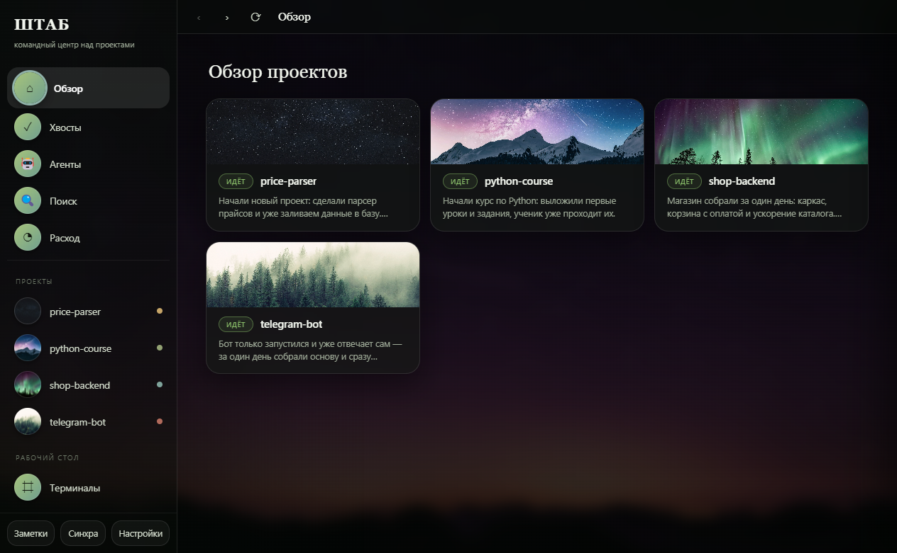

# ШТАБ — командный центр над всеми твоими проектами

**Все проекты в одном тихом окне: что там происходит — человеческим языком, живой ИИ-помощник в каждой папке, задачи агентам в фоне.**

Не «ещё один запускатор агентов для одного репозитория». ШТАБ смотрит на **все** твои проекты сразу — и отвечает на вопрос, на который обычно нет ответа: *«что вообще происходит и за что взяться?»*



---

## Зачем

Проектов много: рабочий монолит, пара ботов, эксперимент, курс, который ты ведёшь. Про каждый помнишь всё меньше. Терминалы разбросаны, ИИ-помощник в каждой папке свой, а «что я тут делал в прошлый вторник» приходится вспоминать по коммитам.

ШТАБ собирает это в один экран:

- **Статус человеческим языком.** Не «14 коммитов, 3 ветки», а «Бот запущен, ждём первую покупку. Дальше — проверить лимиты». Выжимку делает ИИ из журнала проекта или из истории коммитов — сам, когда файлы меняются.
- **Хвосты.** Все «что дальше» со всех проектов одним списком. Пульт недоделок.
- **Терминал в каждой папке.** Живой Claude Code / Codex / Gemini прямо во вкладке. Несколько рядом — «стена терминалов».
- **Фоновые агенты.** Дал задачу → закрыл окно → пришло уведомление → посмотрел изменения → принял или отклонил. Агент работает в отдельной ветке (git worktree) и **не трогает твой код**, пока ты не нажмёшь «Принять».
- **Спросить по всем проектам.** «Где у меня было про парсер цен?» — ИИ отвечает по всем проектам сразу и говорит, где смотреть.
- **Поиск** по именам файлов и содержимому всех репозиториев разом.
- **Расход токенов** по проектам за неделю/месяц — куда уходит лимит подписки.
- **Панели-«отражения».** У проекта может быть своя вкладка-пульт: свежий отчёт, хвост лога, встроенная страница — описывается одним файлом `штаб-борд.json`, без программирования.
- **Синхронизация между машинами.** Тихий `git pull` всех проектов при запуске и возврате в окно + светофор «всё ли уехало на сервер».

Всё локально: твои файлы, твой компьютер, твоя подписка на ИИ. Никакого облака, никакой телеметрии, ничего наружу — подробно в [PRIVACY.md](PRIVACY.md).

---

## Чем отличается от других

| | ШТАБ | Обычные «мишн-контролы» |
|---|---|---|
| Охват | **все проекты сразу** | один репозиторий |
| Статус | **человеческим языком, ИИ-выжимка** | список веток и диффов |
| Windows | **да** (и macOS) | часто только macOS |
| Без GitHub | **да**, работает с обычными локальными папками | обычно нужен GitHub/удалёнка |
| Не-код проекты | **да** (курс, контент, документы) | только код |
| Данные | **только у тебя на диске** | часто облако |

---

## Посмотреть за минуту

Не хочешь ничего настраивать — просто глянь, как оно:

```bash
git clone <адрес-этого-репозитория> shtab && cd shtab
npm install && npm start
```

На стартовом экране нажми **«▶ Открыть на демо-проектах»** — увидишь живой ШТАБ на четырёх демо-проектах: статусы человеческим языком, хвосты, панели. Ничего, кроме Node, для этого не нужно. Убрать демо потом — одна кнопка в Настройках.

## Установка

**Обязателен только [Node.js](https://nodejs.org) 18+** — без него не запустится.

Остальное — по желанию, за него отвечают конкретные фичи:

| Что | Зачем |
|---|---|
| Python 3.10+ | вкладка «Терминал» и ИИ-выжимки статусов |
| [Claude Code](https://claude.com/claude-code) (или Codex / Gemini CLI) | тот же терминал, выжимки, фоновые агенты, «спросить по всем проектам» |

Чего не хватает — видно в **Настройках → Окружение**, там же написано, что ставить.

### macOS / Linux

```bash
git clone <адрес-этого-репозитория> shtab && cd shtab
./Поднять-на-маке.command       # поставит зависимости и запустит
```

Скрипт создаст питон-окружение (`~/.shtab-pyenv`), поставит Electron и запустит приложение. Отдельно `./Собрать-ШТАБ-app.command` соберёт настоящее приложение с иконкой в Dock.

### Windows

Двойной клик по **`Поднять-на-Windows.cmd`** — поставит зависимости (питон-окружение сайдкара + Electron) и запустит. Или вручную:

```bat
npm install
python -m venv term\.venv
term\.venv\Scripts\python -m pip install -r term\requirements.txt
npm start
```

Питон-окружение (`term\.venv`) нужно для встроенного терминала и ИИ-статусов; без него всё остальное работает, а эти две вкладки — нет.

При первом запуске ШТАБ спросит, **где лежат твои проекты** — укажи папку, внутри которой находятся папки-проекты. Всё.

---

## Настройка под себя (необязательно)

Без настройки ШТАБ просто покажет папки как есть. Хочешь красивее — скопируй `профиль.example.json` в `data/профиль.json`:

```jsonc
{
  "names":  { "my-bot": "Телеграм-бот" },        // красивые имена
  "groups": { "python-course": "study" },        // разделы сайдбара
  "live":   { "shop": "https://example.com" },   // вкладка «Живьём»
  "colors": { "shop": "#2ec27e" }                // акцент проекта
}
```

Профиль лежит в `data/` и **никогда не уходит в git** — это личное.

### Своя вкладка-пульт для проекта

Положи в папку проекта `штаб-борд.json`:

```jsonc
{
  "title": "Пульт", "icon": "📊",
  "blocks": [
    { "type": "doc-latest", "label": "Свежий отчёт", "dir": "reports", "ext": ".md" },
    { "type": "log-tail",   "label": "Лог",          "path": "app.log", "lines": 40 },
    { "type": "metric",     "label": "XP",           "path": "progress.json", "key": "xp", "suffix": "очков" },
    { "type": "cmd",        "label": "Обновить",     "cmd": "npm run build" },
    { "type": "embed",      "label": "Дашборд",      "path": "dashboard.html" }
  ]
}
```

Типы блоков: `doc-latest` (самый свежий файл в папке), `file`, `log-tail`, `metric` (одно крупное число из файла — `key` для JSON-пути, `find` — текст, после которого стоит число, или просто первое число в файле), `cmd` (частая команда под рукой), `embed` (локальная страница), `url`. Только чтение, только внутри папки проекта.

> **Про `cmd`:** ШТАБ **никогда не запускает команду сам** — только показывает её и копирует. Enter нажимаешь ты, увидев текст. Это осознанно: `штаб-борд.json` лежит в папке проекта и может приехать из чужого форка, поэтому опции «запускать сразу» не существует.

---

## Как устроено

```
main.js          — главный процесс: проекты, git, агенты, поиск, расход
preload.js       — мост в окно (contextIsolation, без nodeIntegration)
renderer/        — интерфейс (обычные HTML/CSS/JS, без фреймворков)
term/sidecar.py  — локальный сайдкар: держит ИИ-помощника в PTY, отдаёт в окно
                   через xterm.js (только 127.0.0.1, доступ по токену)
refresh_status.py— делает статус-выжимку проекта через headless-режим ИИ
```

Статусы, заметки и настройки живут в `data/` и в git не уходят.

---

## Честные рамки

- Это **личный однопользовательский инструмент**, а не многопользовательский сервис. Всё крутится на твоей машине под твоим пользователем.
- Терминал и агенты запускают **настоящий** ИИ-помощник с доступом к твоим файлам — ровно как если бы ты запустил его руками. ШТАБ ничего не делает молча: агенты правят только свою копию, слияние — по кнопке.
- Никаких `--dangerously-skip-permissions`. Никаких авто-коммитов без спроса.
- Интерфейс на русском (английский — в планах).

## Лицензия

MIT — см. [LICENSE](LICENSE).

Стороннее: [xterm.js](https://xtermjs.org) (MIT), [qrcode-generator](https://www.npmjs.com/package/qrcode-generator) (MIT), фоны — [Unsplash](https://unsplash.com/license).
